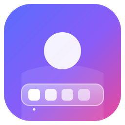

<div align="center">



<h1>Away</h1>

**Make your Mac yours.**

A native macOS app to customize the Dock, widgets, and wallpaper — free, open source, and 100% Swift.

[](https://github.com/OOMestre/Away/actions/workflows/ci.yml)
[](LICENSE)
[](https://apple.com/macos)
[](https://swift.org)
[](https://buymeacoffee.com/omestre)

[Overview](#overview) ·
[Roadmap](#roadmap) ·
[Installation](#installation) ·
[Local Development](#local-development) ·
[Contributing](CONTRIBUTING.md) ·
[Support](SUPPORT.md) ·
[Privacy](docs/PRIVACY.md) ·
[License](#license--trademarks)

</div>

---

> [!NOTE]
> Away is in early development. The first module being built is **Dock customization**. Follow the [CHANGELOG](CHANGELOG.md) and [Releases](https://github.com/OOMestre/Away/releases) for progress.

## Overview

macOS looks great out of the box, but it doesn't give you many ways to make it feel like *your* Mac. Away brings the personalization tools together in one native, lightweight app:

- **No subscriptions, no accounts, no telemetry.** Away is free forever and everything stays on your Mac.
- **Native by design.** Built entirely with Swift, SwiftUI, and AppKit. No Electron, no web views, no third-party dependencies.
- **Reversible.** Every change Away makes to your system can be undone, and you can always go back to the macOS defaults.

## Roadmap

| Module | Status | What it covers |
| :--- | :--- | :--- |
| **Dock** | 🚧 In progress | Appearance, size and magnification, position, spacers and grouping, behavior tweaks, presets you can save and switch between |
| **Widgets** | 🗓️ Planned | Desktop widgets designed to match your setup |
| **Wallpaper** | 🗓️ Planned | Wallpaper management, rotation, and dynamic wallpapers |
| **Profiles** | 💭 Exploring | Save the whole look of your Mac (Dock + widgets + wallpaper) and switch in one click |

Have an idea? [Suggest an improvement](https://github.com/OOMestre/Away/issues/new?template=suggestion.md).

## Installation

Away has no public release yet. Once `v1.0.0` ships, it will be available as a signed DMG on [GitHub Releases](https://github.com/OOMestre/Away/releases) and through Homebrew.

To try the current development build, build it from source:

```bash
git clone https://github.com/OOMestre/Away.git
cd Away
make staging
```

## Local Development

### Prerequisites

- macOS 14.0 (Sonoma) or newer
- Xcode 15+ or Swift 5.9+

### Commands

```bash
make test       # Run the unit test suite
make build      # Build the release binary
make staging    # Build, sign (ad-hoc), and launch "Away Staging.app"
make dmg        # Package the staging app into a DMG
make clean      # Remove build artifacts
```

### Project Layout

```
Sources/
  AwayCore/     Platform logic and models (fully unit tested)
  AwayApp/      SwiftUI / AppKit app target
Tests/
  AwayTests/    XCTest suite for AwayCore
scripts/        Build, DMG, release, and worktree tooling
docs/           Release guide and privacy policy
```

### Branches

| Branch | Purpose |
| :--- | :--- |
| `staging` | Integration branch. All work branches from and targets `staging`. |
| `main` | Stable production releases only, tagged `vX.Y.Z`. |
| `feat/*`, `fix/*`, `refactor/*` | Short-lived work branches. |

Releases follow [Semantic Versioning](https://semver.org). See the [Release Guide](docs/RELEASE_GUIDE.md) for details.

## Contributing

Contributions are welcome! Read [CONTRIBUTING.md](CONTRIBUTING.md) before opening a Pull Request. Pull Requests must target **`staging`**.

## Support the Project

Away is free, open source, and independently developed. If it makes your Mac feel more like home, consider supporting it:

<p>
  <a href="https://buymeacoffee.com/omestre" target="_blank">
    
  </a>
</p>

You can also ⭐ the repository to help more people find it.

## License & Trademarks

Distributed under the **GNU General Public License v3.0**. See [LICENSE](LICENSE).

For the Away name, icon, and branding, see [TRADEMARKS.md](TRADEMARKS.md).
